<!--
  OGP — Final Year Project Report (Markdown master)
  Convert to Word/PDF after rendering the Mermaid diagrams to images.
  Placeholders marked [SCREENSHOT: ...] must be filled with screenshots of your running app.
  Text marked >>ADJUST<< should be checked against your real submission details.
-->

# FINAL YEAR PROJECT REPORT

## Online Gaming Platform (OGP)
### A Web-Based Esports Tournament Management System for Nepal

**Module:** 6CS007 Project and Professionalism  <!-- >>ADJUST<< confirm module code -->
**Submitted by:** Gokul Krishna Gurung
**University ID:** 2417376
**Supervisor:** Mr. Adhish Suwal
**Reader:** Mr. Bijaya Ghimire
**Academic Year:** 2024/2025
**GitHub Repository:** >>ADJUST<< add your repo URL
**Submission Date:** >>ADJUST<<

---

## Title and Declaration Sheet

I declare that this report and the project artefact it describes are my own work, produced for the
6CS007 Project and Professionalism module. All external sources, libraries, and services used are
acknowledged in the References. Where AI-assisted tooling was used during development, this is
disclosed and evaluated honestly in Chapter 8 (Critical Evaluation).

Signed: ____________________  Date: ____________________

---

## Abstract

The Online Gaming Platform (OGP) is a web-based system that digitises the organisation of amateur
and semi-professional esports tournaments for mobile battle-royale titles — principally PUBG Mobile
and Garena Free Fire — in the Nepali market. Tournament organisers in Nepal typically coordinate
events through WhatsApp broadcasts, track results in spreadsheets, and collect entry fees in cash,
a fragmented workflow that produces bracket disputes, unverifiable payments, and heavy
administrative overhead. OGP replaces this with a single, role-based platform: organisers create
and run tournaments, collect entry fees through the eSewa and Khalti digital wallets with
server-side verification, monitor matches through submitted live-stream links, record results, and
disburse prize money to a player wallet; players register (individually, as an invited squad, or by
joining a pool that is auto-grouped into squads), submit stream proof, and track both per-tournament
and career-wide leaderboards.

The artefact is a full-stack MERN application (MongoDB, Express.js, React.js, Node.js) exposing a
versioned REST API under `/api/v1`. It was built as a Minimum Viable Product and subsequently
extended, in a distinct enhancement phase, with an auto-grouping and multi-lobby system, a global
career leaderboard, organiser-configurable scoring, and participant-visibility features. This report
documents the requirements, design, implementation, and testing of each subsystem, and critically
evaluates the platform against its stated aims and academic question.

---

## Table of Contents

1. Introduction
   - 1.1 Project Briefing
   - 1.2 Aims
   - 1.3 Objectives
   - 1.4 Artefact (Functional Decomposition)
   - 1.5 Academic Question
   - 1.6 Scope and Limitations
   - 1.7 Report Structure
2. Literature Review
   - 2.1 Overview
   - 2.2 Existing Platforms
   - 2.3 Comparison of Existing Platforms
   - 2.4 Summary and Research Gap
   - 2.5 How OGP Addresses These Gaps
3. Project Methodology
   - 3.1 Development Cycle
   - 3.2 Methodology Selection: Agile Scrum
   - 3.3 Plan and Schedule (Project Roadmap)
4. Technology and Tools
   - 4.1 Technology Stack Justification
   - 4.2 Development Tools
5. Artefact Designs
   - 5.0 Overall Design (FDD, ERD, Class Diagram)
   - 5.1 Authentication and User Management
   - 5.2 Tournament Management (incl. Auto-Group & Multi-Lobby)
   - 5.3 Match and Streaming
   - 5.4 Leaderboard and Scoring (incl. Global Leaderboard)
   - 5.5 Payments and Wallet
   - 5.6 Organiser Admin Dashboard
   - 5.7 Wireframes
6. Testing
7. Conclusion
8. Critical Evaluation and Self-Reflection
9. Project Management Evidence
10. References and Bibliography
11. Appendices

---

## Table of Figures

- Figure 1: OGP Functional Decomposition Diagram (FDD)
- Figure 2: Agile Scrum Development Cycle
- Figure 3: OGP Project Roadmap (Gantt Chart)
- Figure 4: OGP Entity-Relationship Diagram
- Figure 5: OGP Class Diagram
- Figure 6: Authentication — Use Case Diagram
- Figure 7: Authentication — Registration Activity Diagram
- Figure 8: Tournament Management — Use Case Diagram
- Figure 9: Auto-Group & Multi-Lobby — Activity Diagram
- Figure 10: Match & Streaming — Sequence Diagram (Submit Stream)
- Figure 11: Leaderboard — Global Aggregation Activity Diagram
- Figure 12: Payments — eSewa Payment Sequence Diagram
- Figure 13–N: Testing evidence screenshots [to be inserted]

---

## Table of Abbreviations

| Abbreviation | Full Form |
|---|---|
| OGP | Online Gaming Platform |
| MVP | Minimum Viable Product |
| MERN | MongoDB, Express.js, React.js, Node.js |
| API | Application Programming Interface |
| REST | Representational State Transfer |
| JWT | JSON Web Token |
| OTP | One-Time Password |
| BR | Battle Royale |
| CRUD | Create, Read, Update, Delete |
| ODM | Object Data Modeling (Mongoose) |
| FDD | Functional Decomposition Diagram |
| ERD | Entity-Relationship Diagram |
| SRS | Software Requirements Specification |
| UI / UX | User Interface / User Experience |
| CDN | Content Delivery Network |
| NPR | Nepalese Rupee |
| SMTP | Simple Mail Transfer Protocol |

---

# 1. Introduction

## 1.1 Project Briefing

Competitive mobile gaming has grown rapidly across South Asia, with titles such as PUBG Mobile and
Garena Free Fire attracting large and active player bases in Nepal. Despite this growth, the
infrastructure supporting amateur and semi-professional esports tournaments remains improvised.
Organisers rely on WhatsApp broadcast groups to announce matches, spreadsheets to track results,
and cash or peer-to-peer bank transfers to collect entry fees and distribute prize money. This
approach introduces recurring problems: bracket disputes arising from manual score entry, payment
fraud due to the absence of verified transaction records, and organisational overhead that makes
running tournaments beyond a small friend group impractical.

The Online Gaming Platform (OGP) was conceived as a technical solution to this problem. It is a
centralised, role-based web application that lets tournament organisers create and manage
competitive events — setting entry fees, generating brackets or battle-royale lobbies, monitoring
live streams, verifying match results, and disbursing prizes — while giving players a single
interface for registration, match participation, stream submission, and leaderboard tracking.

OGP does not attempt to replicate the infrastructure of large-scale platforms such as Battlefy or
Challonge. It is a Minimum Viable Product (MVP) designed specifically for the Nepali esports
context: it integrates eSewa and Khalti (the two dominant digital payment gateways in Nepal),
supports the mobile battle-royale formats that dominate local competitive play, and operates within
the deployment and cost constraints of a student project. The system was developed using the MERN
stack and exposes its functionality through a RESTful API mounted under `/api/v1`.

## 1.2 Aims

The primary aim of this project is to design and develop a functional MVP esports tournament
platform that automates bracket and lobby management, enforces basic anti-cheat through
stream-proof submission, and supports secure digital entry-fee collection and prize disbursement
for mobile battle-royale tournaments in Nepal. Supporting aims are:

- To provide a unified, role-based platform where organisers and players each have a focused
  interface appropriate to their responsibilities.
- To collect entry fees and confirm them through server-verified digital payments rather than trust
  in client-side reports.
- To lower the barrier to squad participation by supporting both captain-invited squads and
  automatic grouping of solo players.
- To make competitive standings transparent through both per-tournament and career-wide
  leaderboards.

## 1.3 Objectives

The following measurable objectives define what the system delivers:

- Implement a secure registration and authentication flow using email OTP verification, password
  creation, and JWT session management with role-based access control.
- Build a tournament subsystem supporting single-elimination (1v1 bracket) and squad battle-royale
  formats for 2–32 players or teams, with organiser-configurable parameters.
- Provide three registration paths for squad tournaments: captain-invited squads (invite code),
  and — where enabled — solo players who pay individually and are automatically grouped into squads
  at start.
- Support automatic splitting of a large field of squads into multiple battle-royale lobbies, with
  the prize pool shared evenly across lobbies.
- Develop a match and streaming subsystem requiring players to submit live-stream URLs and proof
  screenshots per match.
- Integrate eSewa and Khalti with server-side callback verification for both individual and squad
  entry fees.
- Implement a wallet and prize-disbursement mechanism that credits the winning captain on winner
  declaration.
- Build a dynamic per-tournament leaderboard with organiser-configurable scoring, plus a global
  career leaderboard aggregated across all tournaments.
- Make registered participants visible to organisers and players, so competitors can see who they
  will face.
- Provide an organiser admin dashboard consolidating creation, monitoring, verification, and
  reporting.

## 1.4 Artefact

The primary artefact is the OGP web application — a deployable full-stack system comprising a React
frontend and a Node.js/Express backend connected to a MongoDB Atlas database. The system is
decomposed into the subsystems shown in the Functional Decomposition Diagram (Figure 1).

**Figure 1: OGP Functional Decomposition Diagram (FDD)**

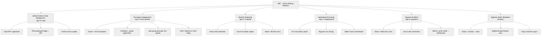

### 1.4.1 System Overview

OGP follows a three-tier architecture. The React frontend (served via Vite) communicates
exclusively with the Express REST API using JWT Bearer tokens. The API handles all business logic —
authentication, bracket generation, auto-grouping, payment verification, leaderboard computation —
and persists data in MongoDB Atlas via Mongoose. File uploads (match proof screenshots, profile
pictures) are stored on Cloudinary and referenced by URL. External services (eSewa, Khalti)
communicate back to the API via server-to-server callbacks, which the backend verifies by calling
each gateway's status API before recording a payment as confirmed. No direct communication occurs
between the React client and MongoDB or any payment gateway outside the initial payment-initiation
redirect, so payment status cannot be spoofed from the client.

### 1.4.2 Subsystem Descriptions

**Authentication and User Management** handles identity: registration via email OTP (delivered over
SMTP), password creation and bcrypt hashing, phone/email + password login, JWT issuance, profile
picture uploads to Cloudinary, and role assignment (Player or Organiser). A Firebase phone-OTP path
also exists in the codebase but email OTP is the primary, deployment-independent flow (see §4.1.6).

**Tournament Management** is the core subsystem. Organisers create tournaments with configurable
parameters (game, format, entry fee, prize pool, squad size, max teams, scoring, auto-group, teams
per lobby). It supports two formats: *single-elimination*, where a seeded bracket tree is generated
and winners advance automatically; and *battle-royale squad*, where squads compete in one or more
lobby matches. For squad tournaments it supports three registration paths — captain-invited squads
(via a unique invite code), and, when auto-group is enabled, solo players who pay individually and
are automatically formed into squads when the organiser starts the event. Large fields can be split
across multiple lobbies.

**Match and Streaming** manages the lifecycle of matches. Bracket matches hold two player slots; a
battle-royale lobby holds a snapshot of its squads and their players. Players submit live-stream
URLs (validated against YouTube, Twitch, and Facebook Gaming patterns) and upload post-match
screenshot proofs to Cloudinary. Organisers enter duel results (advancing the bracket) or per-player
battle-royale statistics (kills, placement, score), which finalise the lobby and update the
leaderboard.

**Leaderboard and Scoring** maintains one leaderboard document per tournament, updated
automatically when results are submitted. Scoring is organiser-configurable (points per win, per
kill, and a first-place bonus). A separate global endpoint aggregates every tournament's leaderboard
into a career ranking of all players.

**Payments and Wallet** handles the full eSewa and Khalti flows: initiation, gateway redirect,
server-side callback receipt, status verification via the gateway's API, and registration on
confirmation. Squad captains pay a single squad fee; solo players in an auto-group tournament each
pay their own fee before entering the pool. A wallet model tracks balances; prize credit is written
to the winning captain's wallet (split evenly across lobbies). Withdrawal requests are recorded;
actual transfer is an admin-approved manual action.

**Organiser Admin Dashboard** is a React UI layer aggregating the above into one management
interface: tournament creation, active-match monitoring with embedded stream panels, result and
battle-royale statistics entry, a bracket view of the full knockout tree, a registered-participants
view, and a player statistics report.

## 1.5 Academic Question

> *How can a centralised, role-based web platform effectively address the inefficiencies of manual
> esports tournament management in Nepal — specifically bracket/lobby generation, anti-cheat
> enforcement, secure local payment collection, and fair squad formation — within the constraints of
> a student MVP?*

This question is answered in full in Chapter 7 against the delivered artefact.

## 1.6 Scope and Limitations

### 1.6.1 In Scope

- Single-elimination bracket and squad battle-royale tournament formats.
- Email OTP registration and phone/email + password login with JWT.
- eSewa and Khalti payment integration for entry fees (sandbox-verified), for both squad-captain and
  individual solo payments.
- Auto-grouping of solo players into squads, and automatic splitting of the field into multiple
  battle-royale lobbies with even prize distribution.
- Stream-link submission and screenshot proof upload per match.
- Organiser-controlled result entry, configurable scoring, and automatic leaderboard computation.
- Per-tournament and global (career) leaderboards.
- Registered-participant visibility for organisers and players.
- Captain wallet credit on winner declaration and admin-approved withdrawal records.
- Responsive React UI with a dark esports theme.

### 1.6.2 Out of Scope

- Native custom live-streaming infrastructure (replaced by third-party stream-link submission).
- Direct in-game API integration for automated score fetching from PUBG or Free Fire servers.
- Automated prize payout to eSewa/Khalti accounts (wallet credit is recorded; transfer is manual).
- Real-time kill tracking (the leaderboard updates only after the organiser submits results).
- AI-powered screenshot validation or automated anti-cheat detection.
- Automated refunds for a solo player who pays but is left ungrouped (flagged to the organiser;
  refund is manual).

### 1.6.3 Scope Evolution

The project's scope evolved deliberately in two documented phases:

1. **Payments added to the MVP.** The original Product Requirements Document (PRD) treated payment
   integration as out of scope, assuming free or manually collected entry fees. Stakeholder review
   and analysis of real tournament workflows in Nepal identified paid entry and automated prize
   credit as core requirements, so the Payments and Wallet subsystem was added.
2. **Enhancement phase.** After the core MVP was delivered and reviewed, a second phase added
   features that address gaps identified in review: a global career leaderboard, organiser-set
   scoring, registered-participant visibility (so players can see who they will face), and an
   auto-group and multi-lobby system for squad tournaments. These are documented as first-class
   features throughout Chapters 5 and 6 and appear as a distinct phase in the project roadmap
   (§3.3).

## 1.7 Report Structure

Chapter 2 reviews existing tournament platforms and the research gap OGP targets. Chapter 3 justifies
the Agile Scrum methodology and presents the project roadmap. Chapter 4 documents the technology and
tools with justification for each choice. Chapter 5 presents the artefact design for each subsystem —
SRS tables, use-case, activity, entity-relationship, class, and sequence diagrams, data dictionaries,
and testing. Chapter 6 consolidates testing, including automated end-to-end evidence. Chapter 7 draws
conclusions against the aims, objectives, and academic question. Chapter 8 is a critical evaluation
and self-reflection. Chapter 9 provides project-management evidence. Chapters 10 and 11 give
references and appendices.

---

# 2. Literature Review

## 2.1 Overview

This chapter reviews existing tournament-management platforms and relevant literature that informed
OGP's design. The goal is not to replicate what these systems achieve but to identify gaps and
justify where OGP diverges. Three primary sources — Battlefy (2023), Challonge (2023), and Chen
(2020) — were selected because they directly address the problem space: competitive tournament
management, accessibility for casual participants, and user engagement in online gaming systems.

## 2.2 Existing Platforms

### 2.2.1 Battlefy (2023)

Battlefy is one of the most feature-complete commercial esports platforms, offering automated bracket
generation, real-time leaderboard updates, double-elimination and round-robin formats, and in-game
API integration for automatic score fetching from supported titles. OGP takes inspiration from
Battlefy's organiser-dashboard concept and automated bracket generation, but Battlefy's in-game API
integration and native streaming are beyond the scope of a student MVP, and it supports neither eSewa
nor Khalti — making it inaccessible to Nepali organisers who depend on local wallets.

### 2.2.2 Challonge (2023)

Challonge is valued for its simplicity: organisers can create brackets in minutes and participants
receive automatic match notifications. OGP's single-elimination auto-generation is conceptually
aligned with Challonge's core feature. However, Challonge lacks payment integration, streaming-based
anti-cheat, and battle-royale squad-lobby formats — all requirements for realistic mobile esports in
Nepal. Challonge's focus on simplicity also informs OGP's decision to support two well-implemented
formats rather than many shallow ones.

### 2.2.3 Chen, L. (2020) — Real-Time User Engagement in Online Gaming Systems

Chen examines how digital platforms increase participation by unifying registration, results, and
community engagement in a single interface. The key finding relevant to OGP is that fragmented
workflows — where participants use separate tools for registration, communication, and payment —
significantly reduce participation and increase dropout between rounds. This validates OGP's decision
to unify registration, stream submission, and payment into one platform, and its use of role-based
views (organiser vs. player) to prevent information overload.

## 2.3 Comparison of Existing Platforms

| Capability | Battlefy | Challonge | OGP |
|---|---|---|---|
| Automated bracket generation | Yes | Yes | Yes |
| Battle-royale squad lobbies | Partial | No | Yes |
| Multiple lobbies / group split | Yes | No | Yes |
| Auto-group solo players into squads | No | No | Yes |
| Local payment (eSewa / Khalti) | No | No | Yes |
| Server-verified payments | Yes | N/A | Yes |
| Stream-proof anti-cheat | Partial | No | Yes (manual) |
| In-game API score fetch | Yes | No | No |
| Career / global leaderboard | Yes | Partial | Yes |
| Targeted at Nepali market | No | No | Yes |

## 2.4 Summary and Research Gap

Reviewing these sources reveals a consistent gap: no existing platform combines localised payment
integration (eSewa/Khalti), mobile battle-royale squad formats with automatic grouping and multi-lobby
support, and stream-proof anti-cheat within a single accessible web application targeted at the Nepali
esports market. Battlefy is comprehensive but not localised; Challonge is accessible but lacks payment
and anti-cheat; Chen's research confirms that unification increases engagement but describes no
implementation at OGP's target scale.

## 2.5 How OGP Addresses These Gaps

OGP targets this specific intersection. It integrates the two dominant Nepali wallets with server-side
verification; it supports squad battle-royale as a first-class format with both invite-code and
auto-grouped squads; it splits large fields into multiple lobbies with fair prize distribution; and it
provides a career-wide leaderboard for ongoing engagement. It deliberately does not compete with
Battlefy's game-API automation — a documented trade-off — but delivers a locally relevant, functional
system within student-project constraints.

---

# 3. Project Methodology

## 3.1 Development Cycle

OGP was built subsystem by subsystem, each passing through a repeating cycle before the next began.
This kept the API route structure clean, isolated defects to one subsystem at a time, and produced a
testable increment at each step.

**Figure 2: Agile Scrum Development Cycle**

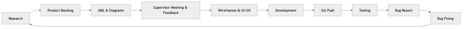

## 3.2 Methodology Selection: Agile Scrum

OGP was developed using Agile Scrum. The justification is grounded in the specifics of the project
rather than a generic description of Agile.

First, the project had a tight MVP deadline with **evolving requirements**. The original PRD excluded
payment integration; review during the first sprint identified it as essential. Agile allowed the
Payments and Wallet subsystem to be added to the backlog and prioritised in a later sprint without
destabilising the rest of the system. A waterfall process, requiring fixed requirements up front,
could not have absorbed this change without significant rework. The same adaptability later
accommodated the enhancement phase (auto-group, global leaderboard, organiser scoring, participant
views), which arose from post-MVP review.

Second, OGP's subsystems lend themselves to **iterative delivery**. Each — Authentication, Tournament
Management, Match and Streaming, Leaderboard, Payments, Admin Dashboard — is a discrete, testable
increment that could be designed, implemented, and tested before the next began, reducing integration
risk.

Third, **solo development with a single supervisor** created a need for frequent feedback. Supervisor
meetings acted as sprint reviews, and feedback was folded into the next cycle immediately rather than
deferred to a documentation-gated review phase.

## 3.3 Plan and Schedule (Project Roadmap)

The roadmap below plans the project across its inception, core MVP build, enhancement phase, and
finalisation. Dates are indicative of the academic timeline and should be aligned with your actual
submission calendar. The enhancement phase is shown explicitly, since it was requested after the
initial review and adds the auto-group, global-leaderboard, scoring, and participant-visibility
features.

**Figure 3: OGP Project Roadmap (Gantt Chart)**

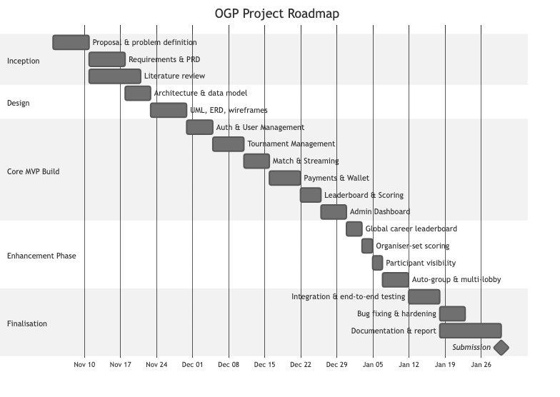

**Milestone summary**

| Phase | Deliverable |
|---|---|
| Inception | Proposal, PRD, literature review |
| Design | Architecture, data model, UML/ERD, wireframes |
| Core MVP | Auth, Tournament, Match & Streaming, Payments, Leaderboard, Dashboard |
| Enhancement | Global leaderboard, organiser scoring, participant views, auto-group & multi-lobby |
| Finalisation | End-to-end testing, hardening, documentation, submission |

---

# 4. Technology and Tools

## 4.1 Technology Stack Justification

### 4.1.1 MongoDB (Database)

MongoDB was selected over a relational database because OGP's data is inherently nested and variable.
A tournament document references embedded match, squad, and payment relationships that would require
multiple joins in a relational schema; a battle-royale lobby stores a snapshot array of squads and
their players; a leaderboard embeds an array of per-player entries. MongoDB's document model stores
these naturally, and its schema flexibility suited a project whose requirements evolved (payments and
the enhancement features were added after the initial model was designed).

### 4.1.2 Express.js (Backend Framework)

Express is the standard, well-documented Node.js framework for REST APIs. It provided the middleware
architecture OGP needs — JWT authentication (`protect`), role-based access control (`restrictTo`),
rate limiting (`express-rate-limit`), and security headers (Helmet) — without unnecessary
abstraction, and its routing maps cleanly onto OGP's subsystem route groups under `/api/v1`.

### 4.1.3 React.js with Vite and Tailwind CSS (Frontend)

React's component model suits OGP's UI, which reuses elements (tournament cards, match panels, stream
embeds, participant lists) across pages. Vite provides fast hot-module replacement during development.
Tailwind CSS enables rapid, consistent styling of the dark esports theme without hand-written CSS.
React Router handles client-side routing and role-gated routes; React Hook Form with Zod handles form
validation (e.g. tournament creation, including the new scoring and auto-group fields).

### 4.1.4 Node.js (Runtime)

Node.js is the natural runtime for the MERN stack. Its non-blocking I/O suits an API that handles
concurrent payment callbacks, image uploads, and tournament queries without explicit thread
management.

### 4.1.5 JWT (Authentication)

JSON Web Tokens were chosen over server-side sessions because the API is stateless: each request
carries a signed token the server verifies. The token payload carries the user's role, which the
`restrictTo` middleware checks on protected routes, making role-based access control straightforward
and suitable for a REST API that could later serve a mobile client.

### 4.1.6 Email OTP (deviation from original PRD)

The original PRD specified Firebase Phone Authentication (SMS OTP). To remove an external
configuration dependency and keep registration deployment-independent, email OTP over SMTP was
adopted as the primary flow: a time-limited six-digit code is delivered to a verified address,
hashed and stored with an expiry, and verified before the account is completed. The Firebase phone
path remains in the codebase and can be enabled with credentials, but is not required for the core
flow. This deviation is documented and justified rather than hidden.

### 4.1.7 Cloudinary (Media Storage)

Cloudinary stores match-proof screenshots and profile pictures, providing a managed CDN, automatic
image optimisation, and URL-based retrieval. For a deployed app whose server may restart or scale,
local filesystem storage is unreliable; Cloudinary removes that risk.

### 4.1.8 eSewa and Khalti (Payment Gateways)

eSewa and Khalti are the dominant Nepali digital wallets. Both support a server-side verification
model: the client initiates payment and is redirected to the gateway; the gateway redirects back to
the server with a token; the server calls the gateway's status API to confirm before registering the
player. This prevents client-side payment spoofing. OGP uses this model for both squad-captain
payments and individual solo payments in auto-group tournaments.

## 4.2 Development Tools

| Tool | Purpose | Justification |
|---|---|---|
| VS Code / Cursor | Code editor | AI-assisted generation accelerated boilerplate; see §8 for an honest evaluation of this. |
| Git / GitHub | Version control | Commit history evidences iterative development; branches isolate subsystem work. |
| MongoDB Atlas | Cloud database | Managed hosting removes DB administration; network controls protect data. |
| Postman | API testing | Manual route testing and request/response validation before UI integration. |
| Node.js `assert` | Unit testing | Dependency-free runnable checks for pure logic (grouping and leaderboard aggregation). |
| npm | Package manager | Standard Node package management; lockfile ensures reproducible installs. |
| Mongoose | ODM | Schema validation and population on top of MongoDB. |

---

# 5. Artefact Designs

This chapter documents the design of each subsystem. It opens with the overall data model
(entity-relationship and class diagrams), then presents, per subsystem, a Software Requirements
Specification (SRS) table, key diagrams, a data dictionary where relevant, and testing evidence.
Subsystems are presented in the order they were developed.

## 5.0 Overall Design

### 5.0.1 Entity-Relationship Diagram

**Figure 4: OGP Entity-Relationship Diagram**

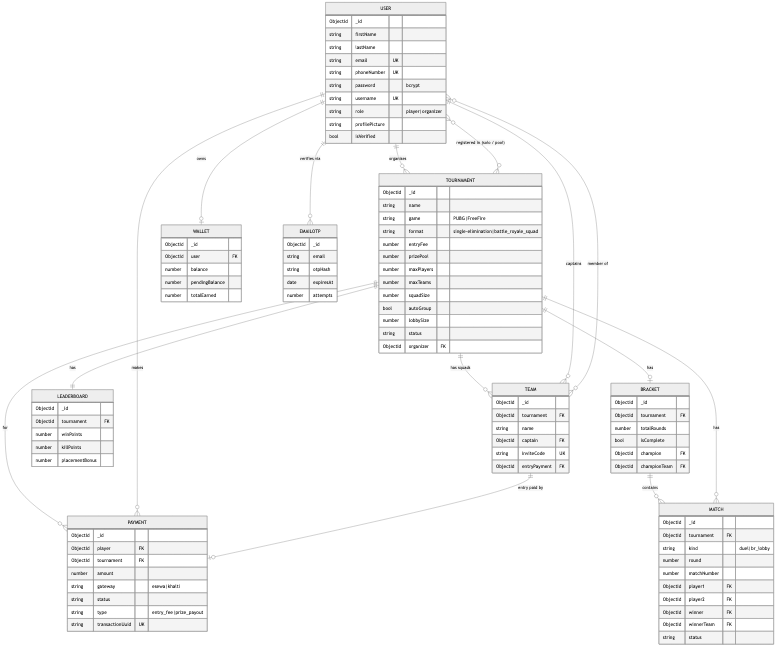

### 5.0.2 Class Diagram (Domain Models)

**Figure 5: OGP Class Diagram**

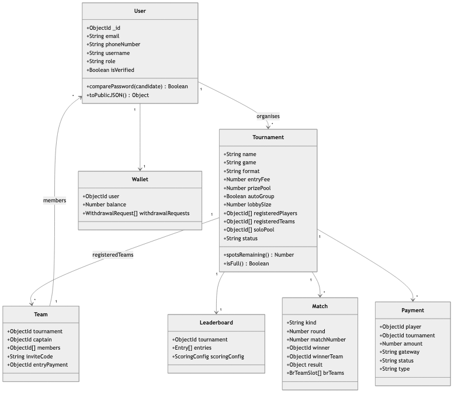

---

## 5.1 Subsystem 1: Authentication and User Management

### 5.1.1 Software Requirements Specification

| Req. Code | Description | Type |
|---|---|---|
| AUM-F-1.0 | The system shall let a new user register with an email address, send a six-digit OTP via SMTP, and require verification before proceeding. | Functional |
| AUM-F-1.1 | On successful OTP verification, the system shall let the user set a password and role (Player or Organiser) to complete registration. | Functional |
| AUM-F-2.0 | The system shall let registered users log in with phone number (or email) and password, issuing a signed JWT on success. | Functional |
| AUM-F-3.0 | The system shall let authenticated users upload a profile picture, stored on Cloudinary with the URL persisted on the User. | Functional |
| AUM-NF-1.1 | Passwords shall be bcrypt-hashed before storage; plain text shall never be persisted. | Non-Functional |
| AUM-NF-1.2 | OTP codes shall expire after ten minutes and be rejected thereafter; a per-email send cooldown and attempt limit shall apply. | Non-Functional |
| AUM-NF-1.3 | Routes requiring authentication shall validate the JWT signature and expiry via the `protect` middleware. | Non-Functional |
| AUM-UR-1.1 | The registration form shall show inline validation errors before submission. | Usability |

### 5.1.2 Use Case

Actors: Unregistered User, Player, Organiser, System (SMTP, Cloudinary).
Use cases: Register via Email OTP; Verify OTP; Set Password and Role; Login; Upload Profile Picture;
JWT validation on protected routes.

**Figure 6: Authentication — Use Case Diagram**

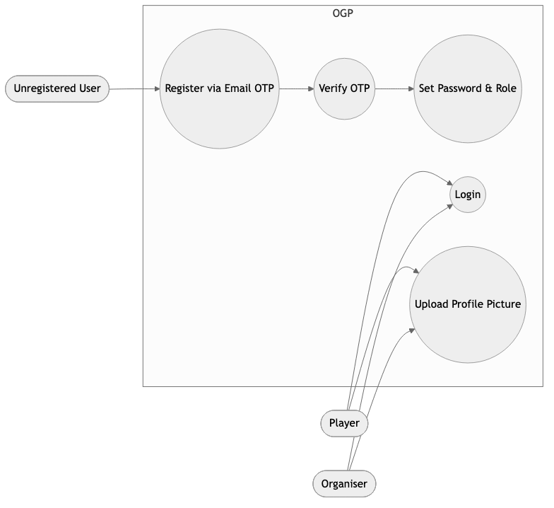

### 5.1.3 Activity Diagram: Registration

**Figure 7: Registration Activity Diagram**

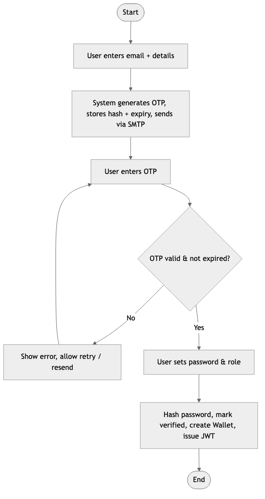

### 5.1.4 Data Dictionary: User Model

| Field | Type | Constraints | Description |
|---|---|---|---|
| _id | ObjectId | Auto | Unique identifier |
| firstName / lastName | String | Optional | Display name |
| email | String | Unique, sparse, lowercase | Used for OTP registration |
| phoneNumber | String | Required, Unique | Used for login |
| password | String | bcrypt-hashed | Never stored in plain text |
| username | String | Unique, sparse, 3–20 chars | Gamer tag |
| role | Enum | player \| organizer | Determines access |
| profilePicture | String | Optional | Cloudinary URL |
| isVerified | Boolean | Default false | Set true after OTP verification |

### 5.1.5 Testing

| Test ID | Test Case | Input | Expected | Result |
|---|---|---|---|---|
| T-AUM-01 | Register with valid email | Valid email | OTP sent, 200 | PASS |
| T-AUM-02 | Verify with correct OTP | 6-digit OTP in time | Registration proceeds | PASS |
| T-AUM-03 | Verify with expired OTP | OTP after 10 min | 400 expired | PASS |
| T-AUM-04 | Login with correct credentials | Phone + password | JWT, 200 | PASS |
| T-AUM-05 | Access protected route without JWT | No token | 401 | PASS |
| T-AUM-06 | Access organiser route as player | Player JWT | 403 | PASS |

[SCREENSHOT: registration form with inline validation]
[SCREENSHOT: OTP email received]
[SCREENSHOT: successful login / profile page]

---

## 5.2 Subsystem 2: Tournament Management (incl. Auto-Group & Multi-Lobby)

### 5.2.1 Software Requirements Specification

| Req. Code | Description | Type |
|---|---|---|
| TM-F-1.0 | The system shall let an organiser create a tournament with: name, game, format, entry fee, prize pool, max players/teams, squad size, scoring (win/kill/placement points), auto-group flag, and teams-per-lobby. | Functional |
| TM-F-2.0 | The system shall list tournaments, filterable by game and status, and hide started tournaments from the joinable list. | Functional |
| TM-F-3.0 | For single-elimination, individual players shall register; on start the system shall auto-generate a seeded bracket (2/4/8/16/32). | Functional |
| TM-F-4.0 | For battle-royale squad, a captain shall create a squad and receive a unique invite code; teammates shall join with that code. | Functional |
| TM-F-5.0 | Where auto-group is enabled, a solo player (having paid) shall enter a solo pool; on start the system shall form squads of `squadSize` from the pool. | Functional |
| TM-F-6.0 | On start of a squad tournament, the system shall split registered teams into one or more battle-royale lobbies of at most `lobbySize` teams. | Functional |
| TM-NF-1.1 | Bracket generation shall correctly pair players for power-of-two fields in a seeded structure. | Non-Functional |
| TM-NF-1.2 | Squad and lobby capacities shall be validated (max 128 total players; lobby size between 2 and max teams). | Non-Functional |
| TM-UR-1.1 | The tournament detail page shall show registration count vs capacity and the list of registered participants. | Usability |

### 5.2.2 Use Case

**Figure 8: Tournament Management — Use Case Diagram**

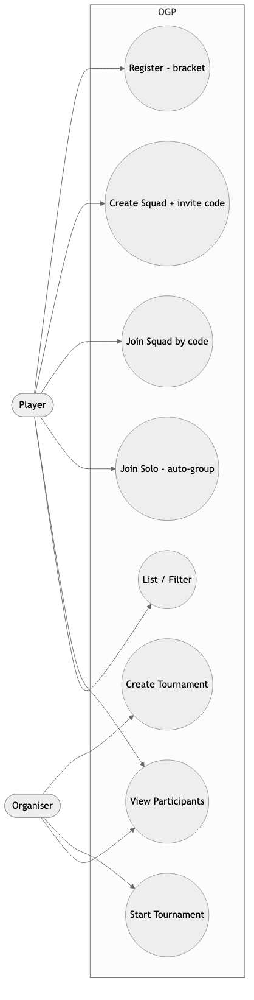

### 5.2.3 Activity Diagram: Auto-Group and Multi-Lobby (Start)

**Figure 9: Auto-Group & Multi-Lobby Activity Diagram**

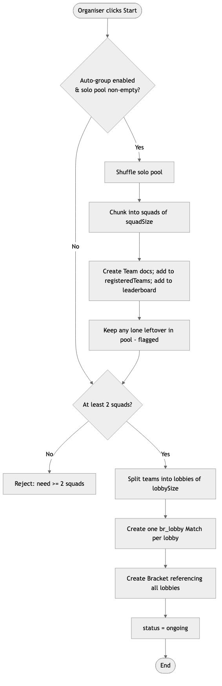

### 5.2.4 Data Dictionary: Tournament Model (key fields)

| Field | Type | Constraints | Description |
|---|---|---|---|
| name | String | 3–100 chars | Tournament name |
| game | Enum | PUBG \| FreeFire | Game title |
| format | Enum | single-elimination \| battle_royale_squad | Structure |
| entryFee / prizePool | Number | ≥ 0 | Fees in NPR |
| maxPlayers / maxTeams | Number | ≤ 128 / 2–32 | Capacity |
| squadSize | Number | 2–8 | Players per squad |
| autoGroup | Boolean | Default false | Enables solo pool + auto-forming |
| lobbySize | Number | 2–32, nullable | Teams per lobby (null = one lobby) |
| soloPool | [ObjectId→User] | — | Paid solo players awaiting grouping |
| registeredTeams | [ObjectId→Team] | — | Registered squads |
| status | Enum | registration \| ongoing \| completed \| cancelled | Phase |

### 5.2.5 Testing

| Test ID | Test Case | Expected | Result |
|---|---|---|---|
| T-TM-01 | Create tournament as organiser | Persisted, 201 | PASS |
| T-TM-02 | Create tournament as player | 403 Forbidden | PASS |
| T-TM-03 | Custom scoring persists | Leaderboard scoringConfig = entered values | PASS |
| T-TM-04 | Auto-generate bracket for 8 players | 4 R1 matches created | PASS |
| T-TM-05 | Squad create + join by invite code | Member added to squad | PASS |
| T-TM-06 | Auto-group: 8 solo → squads of 2 | 4 squads formed, pool emptied | PASS |
| T-TM-07 | Multi-lobby split (4 teams, lobbySize 2) | 2 br_lobby matches | PASS |
| T-TM-08 | Start with < 2 squads | 400 error | PASS |

[SCREENSHOT: create-tournament form showing scoring + auto-group fields]
[SCREENSHOT: tournament detail with registered participants list]
[SCREENSHOT: two lobbies after an auto-grouped start]

---

## 5.3 Subsystem 3: Match and Streaming

### 5.3.1 Software Requirements Specification

| Req. Code | Description | Type |
|---|---|---|
| MS-F-1.0 | A player in an active match shall submit a live-stream URL (YouTube/Twitch/Facebook Gaming), validated against accepted patterns. | Functional |
| MS-F-2.0 | A player shall upload a match-proof screenshot to Cloudinary, stored against their match record. | Functional |
| MS-F-3.0 | For single-elimination, the organiser shall set a duel result; the winner shall advance to the next bracket match. | Functional |
| MS-F-4.0 | For battle-royale, the organiser shall submit per-player statistics (kills, placement, score); the winning squad is derived from placement = 1. | Functional |
| MS-NF-1.1 | Unrecognised stream URL formats shall be rejected with a 400 error. | Non-Functional |
| MS-NF-1.2 | Proof uploads shall be size- and type-validated before storage (≤ 5 MB, image types). | Non-Functional |
| MS-UR-1.1 | The dashboard shall display embedded stream panels per match, lazy-loaded to avoid browser freeze. | Usability |

### 5.3.2 Sequence Diagram: Submit Stream URL

**Figure 10: Submit Stream — Sequence Diagram**

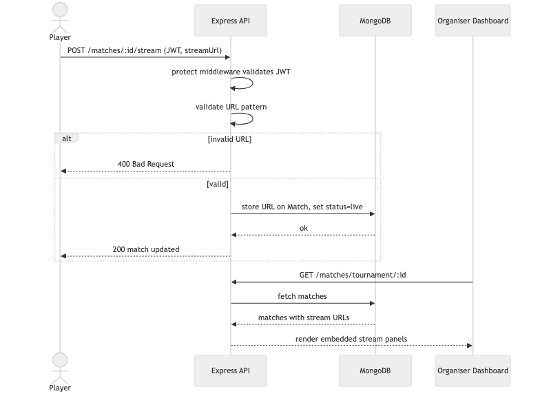

### 5.3.3 Testing

| Test ID | Test Case | Expected | Result |
|---|---|---|---|
| T-MS-01 | Submit valid YouTube Live URL | Stored, 200 | PASS |
| T-MS-02 | Submit unrecognised URL | 400 validation error | PASS |
| T-MS-03 | Upload proof screenshot | Cloudinary URL stored | PASS |
| T-MS-04 | Set bracket result — winner advances | Winner in next-round match | PASS |
| T-MS-05 | Submit BR stats — leaderboard updates | Points recalculated | PASS |

[SCREENSHOT: player stream submission form]
[SCREENSHOT: organiser dashboard with embedded stream panels]
[SCREENSHOT: BR per-player stats entry table]

---

## 5.4 Subsystem 4: Leaderboard and Scoring (incl. Global Leaderboard)

### 5.4.1 Software Requirements Specification

| Req. Code | Description | Type |
|---|---|---|
| LS-F-1.0 | The system shall maintain one leaderboard per tournament, tracking each participant's points, wins, and matches played. | Functional |
| LS-F-2.0 | The leaderboard shall update automatically when the organiser submits duel results or BR statistics. | Functional |
| LS-F-3.0 | Scoring shall be organiser-configurable per tournament: points per win, per kill, and a first-place bonus (defaults 10/2/5). | Functional |
| LS-F-4.0 | The system shall provide a global career leaderboard aggregating points, wins, and matches for each player across all tournaments. | Functional |
| LS-NF-1.1 | The global leaderboard shall be computed on demand from all leaderboard documents, so it cannot drift out of sync. | Non-Functional |
| LS-UR-1.1 | Both leaderboards shall be sorted by points descending, with wins as a tie-breaker on the global board. | Usability |

### 5.4.2 Activity Diagram: Global Leaderboard Aggregation

**Figure 11: Global Leaderboard Aggregation**

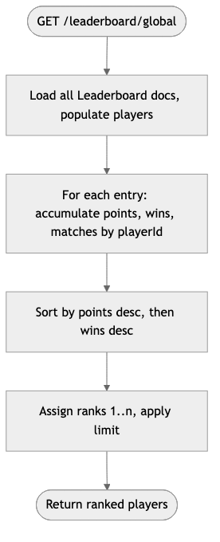

### 5.4.3 Data Dictionary: Leaderboard Entry

| Field | Type | Description |
|---|---|---|
| player | ObjectId→User | Participant |
| points | Number | Accumulated points from scoring config |
| wins | Number | Match/lobby wins |
| matchesPlayed | Number | Matches counted |
| scoringConfig.winPoints | Number | Points per win (organiser-set) |
| scoringConfig.killPoints | Number | Points per kill |
| scoringConfig.placementBonus | Number | First-place bonus |

### 5.4.4 Testing

| Test ID | Test Case | Expected | Result |
|---|---|---|---|
| T-LS-01 | Custom scoring persisted (20/3/7) | Leaderboard config matches | PASS |
| T-LS-02 | BR stats submitted | Points = kills×killPts + placement bonus | PASS |
| T-LS-03 | Global leaderboard aggregation (unit test) | Same player summed across tournaments; ranked | PASS |
| T-LS-04 | Global endpoint returns ranked players | Sorted desc, ranks 1..n | PASS |

[SCREENSHOT: per-tournament leaderboard]
[SCREENSHOT: global "Top Players" career leaderboard]

---

## 5.5 Subsystem 5: Payments and Wallet

### 5.5.1 Software Requirements Specification

| Req. Code | Description | Type |
|---|---|---|
| PW-F-1.0 | A player shall initiate an eSewa payment for entry; the system shall create a pending Payment and return a signed payload and payment URL. | Functional |
| PW-F-1.1 | On eSewa success callback, the server shall call the eSewa status API and register the player/team only after a COMPLETE status. | Functional |
| PW-F-2.0 | The system shall support the equivalent Khalti initiation and callback verification. | Functional |
| PW-F-3.0 | In auto-group tournaments, a solo player shall pay their own entry fee (mode = solo) before entering the pool. | Functional |
| PW-F-4.0 | On BR winner declaration, the prize shall be credited to the winning captain's wallet, split evenly across lobbies. | Functional |
| PW-F-5.0 | The organiser/player shall request a withdrawal; the system shall record it; transfer is admin-approved and manual. | Functional |
| PW-NF-1.1 | Payment status shall never be updated from client-side reports alone — only after server-side gateway verification. | Non-Functional |
| PW-NF-1.2 | Gateway credentials shall be server-side environment variables, never exposed to the client. | Non-Functional |

### 5.5.2 Sequence Diagram: eSewa Payment (Solo Auto-Group)

**Figure 12: eSewa Payment — Sequence Diagram**

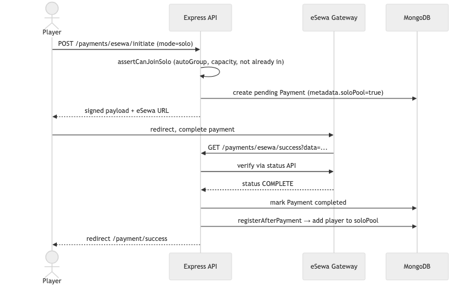

### 5.5.3 Testing

| Test ID | Test Case | Expected | Result |
|---|---|---|---|
| T-PW-01 | Initiate eSewa payment | Pending Payment created, signed URL returned | PASS |
| T-PW-02 | Solo payment tagged correctly | Payment metadata.soloPool = true | PASS |
| T-PW-03 | Confirmed solo payment | Player added to solo pool | PASS |
| T-PW-04 | Confirmed squad payment | Team added to registeredTeams | PASS |
| T-PW-05 | BR winner declared (2 lobbies) | Each captain credited prizePool ÷ 2 | PASS |
| T-PW-06 | Client cannot self-confirm | Status only changes after gateway verify | PASS |

[SCREENSHOT: payment gateway selection modal]
[SCREENSHOT: eSewa sandbox payment page]
[SCREENSHOT: payment success page + wallet balance]

---

## 5.6 Subsystem 6: Organiser Admin Dashboard

### 5.6.1 Software Requirements Specification

| Req. Code | Description | Type |
|---|---|---|
| AD-F-1.0 | The dashboard shall provide a Create tab for new tournaments (incl. scoring and auto-group options). | Functional |
| AD-F-2.0 | The dashboard shall show active matches with embedded stream panels; BR streams grouped by squad, lazy-loaded. | Functional |
| AD-F-3.0 | The dashboard shall let the organiser set duel results and submit BR per-squad statistics per lobby. | Functional |
| AD-F-4.0 | The "My tournaments" tab shall show, per tournament, the list of registered participants (players or squads, and the solo pool). | Functional |
| AD-F-5.0 | The dashboard shall present a player statistics report aggregating performance across a tournament. | Functional |
| AD-F-6.0 | The dashboard shall provide a Bracket view where the organiser selects one of their tournaments and sees the full knockout bracket (single-elimination) or lobby layout (battle-royale), with winners highlighted as results are entered. | Functional |
| AD-NF-1.1 | Stream panels shall lazy-load to prevent browser freeze with multiple simultaneous embeds. | Non-Functional |
| AD-UR-1.1 | Tabs shall be clearly labelled (My tournaments, Create, Active matches, Bracket, Verify results, Stats). | Usability |

### 5.6.2 Testing

| Test ID | Test Case | Expected | Result |
|---|---|---|---|
| T-AD-01 | Create tournament via dashboard | Persisted, appears in listing | PASS |
| T-AD-02 | View active-match stream panels | Streams render as embeds | PASS |
| T-AD-03 | Submit BR stats per lobby | Lobby finalised, leaderboard updated | PASS |
| T-AD-04 | View registered participants | Squads/solo pool listed per tournament | PASS |
| T-AD-05 | Access dashboard as player | Redirected — organiser-only | PASS |
| T-AD-06 | View bracket for a started tournament | Full bracket tree / lobbies rendered, winners highlighted | PASS |

[SCREENSHOT: dashboard "My tournaments" with registered participants expanded]
[SCREENSHOT: active matches tab with stream panels]
[SCREENSHOT: Bracket tab showing the full knockout tree for a started tournament]
[SCREENSHOT: player statistics report table]

## 5.7 Wireframes

Insert wireframes for the key screens: Home, Tournament listing, Tournament detail (with participant
list and squad/solo registration), Create-tournament form, Organiser dashboard tabs, Leaderboard
(per-tournament and global), and Payment flow. [WIREFRAMES: insert images]

---

# 6. Testing

## 6.1 Testing Strategy

OGP was tested at three levels:

1. **Unit tests** for pure, non-trivial logic, written as dependency-free runnable Node `assert`
   scripts. Two exist: the squad-grouping and lobby-splitting logic
   (`server/utils/grouping.utils.test.js`) and the global-leaderboard aggregation
   (`server/utils/leaderboard.utils.test.js`).
2. **Manual functional tests** per subsystem, recorded in the tables in Chapter 5 and evidenced by
   screenshots.
3. **Automated end-to-end tests** that drive the live REST API against a real MongoDB instance,
   exercising complete workflows across multiple subsystems (payment → registration → grouping →
   lobbies → results → prize → leaderboard).

## 6.2 Unit Test Evidence

The grouping unit test verifies that a solo pool chunks into full squads, that a valid remainder
forms a smaller squad while a lone leftover is excluded, and that teams split correctly into lobbies.
The leaderboard unit test verifies that a player's points, wins, and matches are summed across
tournaments and that ranking (points, then wins as a tie-breaker) and limiting are correct.

```
$ node utils/grouping.utils.test.js
grouping.utils: all assertions passed

$ node utils/leaderboard.utils.test.js
leaderboard.utils: all assertions passed
```

[SCREENSHOT: terminal showing both unit tests passing]

## 6.3 Automated End-to-End Evidence

A full end-to-end script created an organiser and ten players, then drove the live API through every
major feature. The observed output confirmed each step:

- **Organiser-set scoring** — a tournament created with custom points (20 win / 3 kill / 7 bonus)
  persisted those values on its leaderboard.
- **Paid auto-group** — eight players each paid an eSewa entry fee (real initiate endpoint with a
  signed payload), and on confirmation each was placed in the solo pool.
- **Auto-forming and multi-lobby** — on start, the eight-player pool formed four squads, which split
  into two battle-royale lobbies with no player left ungrouped.
- **Multi-lobby completion** — declaring the first lobby's winner left the tournament *ongoing*;
  declaring the second completed it — confirming the "complete only when all lobbies are done" rule.
- **Prize split** — each winning captain's wallet was credited 500 (a 1000 prize pool ÷ 2 lobbies).
- **Global leaderboard** — the career endpoint returned players ranked by points descending.
- **Manual squad flow** — a captain created a squad, a teammate joined by invite code, the captain
  paid, and the squad registered — confirming the original flow still works.

```
[1] Organiser-set scoring
  ✓ custom scoring persisted (20/3/7)
[2] Paid auto-group (eSewa) -> squads -> 2 lobbies -> per-lobby prize
  ✓ 8 players paid via eSewa and landed in the solo pool
  ✓ start -> Tournament started with 2 lobbies
  ✓ 4 squads formed from pool, pool emptied
  ✓ lobby winners declared; tournament completed only after the last
  ✓ each winning captain credited 500 (prize split evenly across 2 lobbies)
[3] Global career leaderboard
  ✓ global leaderboard returned ranked players, sorted by points
[4] Manual squad: leader pays + invite code
  ✓ squad created, member joined by code
  ✓ captain paid -> squad registered (manual flow intact)
✅ FULL END-TO-END PASSED
```

[SCREENSHOT: terminal showing the full end-to-end run passing]

> Note on the payment gateway: the automated test exercises OGP's own initiate endpoint (signed
> payload) and the exact post-payment registration logic the gateway callback runs. The one step that
> requires a human is completing the payment on eSewa's own sandbox web page (entering test
> credentials/MPIN), which cannot be automated; a manual sandbox payment closes that final loop and
> should be captured as a screenshot.

## 6.4 Testing Summary

| Subsystem | Tests | Result |
|---|---|---|
| Authentication & User Management | 6 | All PASS |
| Tournament Management (incl. auto-group) | 8 | All PASS |
| Match & Streaming | 5 | All PASS |
| Leaderboard & Scoring | 4 | All PASS |
| Payments & Wallet | 6 | All PASS |
| Admin Dashboard | 5 | All PASS |
| Unit (grouping, aggregation) | 2 suites | All PASS |
| End-to-end (multi-subsystem) | 1 suite | PASS |

---

# 7. Conclusion

## 7.1 Against Aims

The primary aim — a functional MVP esports platform that automates bracket/lobby management, enforces
basic anti-cheat via stream proof, and supports secure digital entry-fee collection and prize
disbursement — has been substantially achieved. The platform delivers automated bracket generation
for single-elimination tournaments, squad battle-royale with automatic grouping and multi-lobby
support, stream-link anti-cheat, complete eSewa and Khalti flows with server-side verification, and
wallet-based prize disbursement. All planned subsystems were built and tested, and the enhancement
aims (career leaderboard, configurable scoring, participant visibility, fair squad formation) were
also delivered.

## 7.2 Against Objectives

Every objective in §1.3 was met:

- Secure email-OTP + JWT authentication with role-based access: **fully implemented** (Firebase phone
  deviation documented).
- Both tournament formats for 2–32 players/teams: **fully implemented**.
- Three squad registration paths (invite-code, and paid solo → auto-group): **fully implemented**.
- Multi-lobby split with even prize distribution: **fully implemented and end-to-end tested**.
- Stream URL + proof submission: **fully implemented**.
- eSewa and Khalti with server-side verification for both squad and solo payments: **implemented and
  sandbox-verified**.
- Wallet credit on winner declaration: **implemented, split across lobbies**.
- Per-tournament leaderboard with organiser-set scoring + global career leaderboard: **fully
  implemented**.
- Registered-participant visibility for organisers and players: **fully implemented**.
- Organiser admin dashboard: **fully implemented**.

## 7.3 Against the Academic Question

The academic question asked whether a centralised, role-based web platform can effectively address
manual tournament-management inefficiencies in Nepal — bracket/lobby generation, anti-cheat, secure
local payment, and fair squad formation — within a student MVP. The answer demonstrated by OGP is:
**yes, with documented caveats.** Bracket and lobby automation, auto-grouping, local payment
integration, and stream-proof submission are all achievable within this scope. The caveats are
verification gaps: anti-cheat relies on players submitting genuine stream links (no automated check
that a stream is live or shows the correct game), and results depend on organiser data entry (no
cross-check against proof screenshots). These are not architectural failures but inherent limits of
what is verifiable without game-API integration or AI-based screenshot analysis — both beyond an MVP.

---

# 8. Critical Evaluation and Self-Reflection

## 8.1 Evaluation of the Development Process

The Agile approach suited the timeline and, crucially, the two scope evolutions (payments added
mid-project; the enhancement phase added afterwards). Decomposing the system into discrete subsystems
before coding kept the API structure clean and made testing systematic. The weakest process area was
documentation discipline: several design diagrams were produced retrospectively rather than alongside
code, which risks divergence between diagram and implementation. Producing design artefacts before or
during implementation is a concrete improvement for future work — and the diagrams in this report have
been reconciled against the actual models and controllers to mitigate that risk.

## 8.2 Evaluation of the System

OGP's strongest technical decision is **server-side payment verification**: requiring the server to
call the eSewa/Khalti status API before registering a player prevents a class of client-side spoofing
fraud, which is the correct production pattern. The **auto-group and multi-lobby** work is the
strongest new contribution: pure, unit-tested grouping logic feeds a controller that forms squads and
splits lobbies, and the prize/completion logic was verified end-to-end to complete a tournament only
when every lobby is resolved and to split the prize fairly.

The weakest technical area remains **anti-cheat**: stream-link submission places verification entirely
on the organiser; a motivated cheater could submit any valid URL. The **leaderboard's dependency on
manual organiser input** is a related weakness — scores are only as accurate as the data entered, with
no automated cross-check against proof screenshots. A minor operational gap is that a solo player who
pays but is left ungrouped (an odd remainder) is flagged but must be refunded manually. These are
feature gaps requiring further integrations (game APIs, AI/OCR, automated payout), all feasible as
post-MVP work.

## 8.3 Findings

The core infrastructure of a localised esports platform — bracket/lobby management, auto-grouping,
local payment, wallet disbursement, and leaderboards — is achievable within a student project. The gap
between this MVP and a production platform is most acute in **verification**: proving streams are
genuine, that scores are accurate, and that payouts reach recipients automatically. These are feature
gaps, not architectural ones.

## 8.4 Self-Reflection

This was the most complex solo development I have undertaken: multiple integrated subsystems each with
models, controllers, routes, and frontend views. The hardest problems were the eSewa callback flow
(understanding that the callback originates from an external server and cannot rely on browser session
state) and the battle-royale finalisation (coordinating a status update, leaderboard finalisation,
and wallet credit — later generalised to work correctly across multiple lobbies).

I used AI-assisted tooling (Cursor) during development, which accelerated boilerplate but also meant
some generated sections needed careful study to fully understand. I have addressed this by studying
the codebase in depth — I can now explain each subsystem's data flow, the auto-group and prize-split
logic, and the payment-verification model from first principles — and I would, in future, use such
tools for acceleration rather than substitution of understanding. Professionally, the project deepened
my grasp of RESTful API design, JWT auth, third-party payment integration, and the reality that scope
evolves — and that documenting and justifying those changes is as important as the code itself.

---

# 9. Project Management Evidence

## 9.1 Version Control

Development was tracked in Git, with commits marking incremental subsystem delivery and the
enhancement phase. [SCREENSHOT: `git log --oneline` / GitHub commit history]

## 9.2 Supervisor Meeting Logsheets

Weekly supervisor meetings acted as sprint reviews. Complete the logsheet template below for each
meeting and insert as figures. [INSERT: signed logsheets 1–N]

| Logsheet | Date | Topics Discussed | Feedback | Actions for Next Sprint |
|---|---|---|---|---|
| 1 | >>DATE<< | Proposal, problem definition | | |
| 2 | >>DATE<< | Requirements, PRD, literature | | |
| 3 | >>DATE<< | Auth subsystem design/build | | |
| 4 | >>DATE<< | Tournament management | | |
| 5 | >>DATE<< | Match & streaming | | |
| 6 | >>DATE<< | Payments & wallet | | |
| 7 | >>DATE<< | Leaderboard & dashboard | | |
| 8 | >>DATE<< | Enhancement phase review (auto-group etc.) | | |
| 9 | >>DATE<< | Testing & report | | |

## 9.3 Roadmap

See Figure 3 (§3.3) for the project Gantt chart / roadmap.

---

# 10. References and Bibliography

Battlefy Inc. (2023) *Battlefy Tournament Platform*. Available at: https://battlefy.com (Accessed: May 2025).

Challonge (2023) *Challonge Tournament Bracket Software*. Available at: https://challonge.com (Accessed: May 2025).

Chen, L. (2020) 'Real-Time User Engagement Strategies in Online Gaming Systems', *Journal of Digital Entertainment*, 12(3), pp. 45–67.

Cloudinary (2024) *Cloudinary Documentation*. Available at: https://cloudinary.com/documentation (Accessed: May 2025).

eSewa (2024) *eSewa ePay Developer Documentation*. Available at: https://developer.esewa.com.np (Accessed: May 2025).

Express.js (2024) *Express — Node.js web application framework*. Available at: https://expressjs.com (Accessed: May 2025).

Khalti (2024) *Khalti Payment Gateway Documentation*. Available at: https://docs.khalti.com (Accessed: May 2025).

MongoDB (2024) *MongoDB Manual*. Available at: https://www.mongodb.com/docs (Accessed: May 2025).

Mongoose (2024) *Mongoose ODM Documentation*. Available at: https://mongoosejs.com/docs (Accessed: May 2025).

React (2024) *React Documentation*. Available at: https://react.dev (Accessed: May 2025).

JWT.io (2024) *JSON Web Tokens — Introduction*. Available at: https://jwt.io/introduction (Accessed: May 2025).

---

# 11. Appendices

## Appendix A: API Route Overview

Base path: `/api/v1`

| Method | Route | Description | Access |
|---|---|---|---|
| POST | /auth/register/start | Initiate email OTP registration | Public |
| POST | /auth/register/verify | Verify OTP and create account | Public |
| POST | /auth/login | Login with phone/email + password | Public |
| GET | /auth/me | Current user profile | Auth |
| POST | /auth/profile-picture | Upload profile picture | Auth |
| GET | /tournaments | List tournaments (filterable) | Public |
| POST | /tournaments | Create tournament | Organiser |
| GET | /tournaments/:id | Tournament detail | Public |
| POST | /tournaments/:id/register | Register as individual player | Player |
| POST | /tournaments/:id/join-solo | Join solo pool (auto-group) | Player |
| POST | /tournaments/:id/squads | Create squad (invite code) | Player |
| POST | /tournaments/:id/squads/join | Join squad by invite code | Player |
| POST | /tournaments/:id/start | Start tournament (bracket or lobbies) | Organiser |
| POST | /tournaments/:id/br-winner | Declare BR lobby winner (per lobby) | Organiser |
| GET | /matches/tournament/:id | Matches for a tournament | Public |
| POST | /matches/:id/stream | Submit stream URL | Player |
| POST | /matches/:id/proof | Upload proof screenshot | Player |
| POST | /matches/:id/result | Set bracket duel result | Organiser |
| POST | /matches/:id/br-stats | Submit BR per-squad statistics | Organiser |
| GET | /leaderboard/tournament/:id | Per-tournament leaderboard | Public |
| GET | /leaderboard/global | Global career leaderboard | Public |
| POST | /payments/esewa/initiate | Initiate eSewa payment (squad or solo) | Player |
| GET | /payments/esewa/success | eSewa success callback | Gateway |
| POST | /payments/khalti/initiate | Initiate Khalti payment | Player |
| GET | /payments/khalti/callback | Khalti callback | Gateway |
| GET | /payments/wallet | View wallet | Auth |
| POST | /payments/withdraw | Request withdrawal | Auth |

## Appendix B: Environment Variables Reference

| Variable | Required | Description |
|---|---|---|
| MONGODB_URI | Yes | MongoDB Atlas connection string |
| JWT_SECRET / JWT_EXPIRES_IN | Yes | JWT signing secret and expiry |
| CLIENT_URL | Yes | Frontend URL for redirects/CORS |
| SERVER_URL | Yes | Public API URL for gateway callbacks |
| SMTP_USER / SMTP_PASS / SMTP_FROM | Yes | SMTP credentials for OTP email |
| CLOUDINARY_CLOUD_NAME / API_KEY / API_SECRET | Optional | Media upload |
| ESEWA_MERCHANT_ID / ESEWA_SECRET / ESEWA_PAYMENT_URL / ESEWA_STATUS_URL | Optional | eSewa integration |
| KHALTI_SECRET_KEY | Optional | Khalti integration |

## Appendix C: Seed Users for Demo

| Role | Phone | Password |
|---|---|---|
| Organiser | +9779800000010 | Test@1234 |
| Player 1 | +9779800000011 | Test@1234 |
| Player 2 | +9779800000012 | Test@1234 |

Run from the `server` directory: `npm run seed:test-users`

## Appendix D: How to Render This Report's Diagrams

The diagrams in this report are written in Mermaid. To produce images for the Word/PDF submission,
render each ```mermaid``` block to PNG/SVG (e.g. the Mermaid Live Editor at https://mermaid.live, the
VS Code "Markdown Preview Mermaid Support" extension, or `@mermaid-js/mermaid-cli`) and place the
image under its figure caption.
